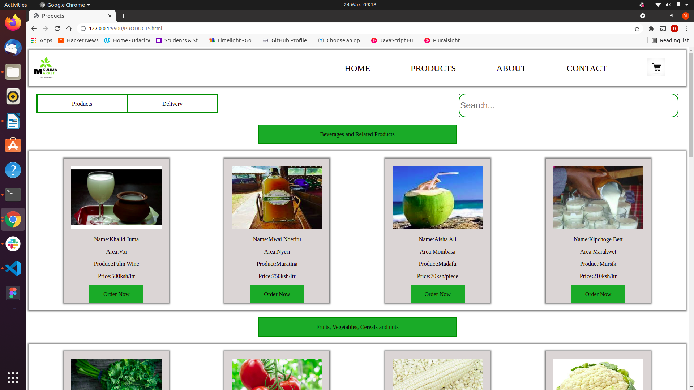

## Mkulima Market Website
This a platform that will enable farmers  get a direct market for their farm produce. 

By Benjamin Kipkorir, Daniel Muruthi,Viola Kaveza & Caleb Kipng'etich

## Description
This a website or platform that will help farmers get a direct market for their farm products,first a farmer must create an account, login and navigate to product page where they can upload images of their products they want to sell and also leave other details like:name,location, price.

## Setup/Installation Requirements
Development environment
internet
Git
Laptop
Browser
## screenshots of our website
home page
welcome to our website,create account here and navigate our site

product page
If you want to post images of the products get to this page

about page
know more about us in the about page

contact page
Get to contact page and get in touch with us.

## Known Bugs
At the moment there are no known buggs

## Technology Used
HTML5
CSS 
JavaScript

## Support and contact details
Reach us on these emails:pkobenj41@gmail.com,violakaveza@gmail.com,adinomuruthi1@gmail.com,calebkimutai97@gmail.com

## License
MIT license
Copyright (c)2021 By Benjamin Kipkorir
                     Daniel Muruthi
                     Viola Kaveza
                     Caleb Kipng'etich   